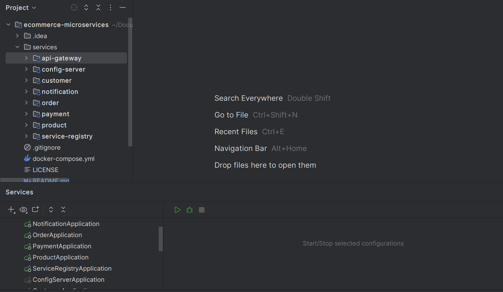

# Ecommerce microservices


## Documentation
To work with the project, you need to ensure you have docker installed on your local machine.
The docker compose file contains configuration of the postgres, application network, kafka, mail, zookeeper and zipkin.

Remember to run the file on the root folder
```angular2html
docker-compose up -d
```
Ensure all containers have been created

## Project specification
The project is Ecommerce microservices that have Customer, Order, Product, Notification and Payment service.
It also service-registry, api gateway, and config-server which makes the microservices to run smoothly.
## Features
- Create,Edit,Delete and Update customers on Customer Service.
- Create,Edit,Delete and Update Products on Product Service.
- Payment using the payment service.
- Notification by the Notification service. When an order is successfully made, a notification is sent as mail to the customer with the payment notification. 
- Order Service, which gives a customer ability to make orders on the system.
- Kafka ensures communication between the services.
- Load balancing on the API-Gateway.
- Tracing using zipkin. It monitors of the api calls and shows the services which were used during the API Call.

## Technologies Used
- Spring Boot
- PostgreSQL
- Mongo DB
- Kafka
- Zipkin
- Spring gateway
- Eureka discovery
- Docker
- Open Feign

## Installation
1. Clone the repository $ git clone https://github.com/nzangi/ecommerce-microservices.git
2. Import the project inside IntelliJ IDEA-Open Intellij IDEA > choose where project was clone to
3. Make sure you are in the ecommerce-microservices directory.
4. Ensure you have JDK 17 installed.
5. Run the application. 